# Java手记
&copy; 全网最好韩顺平
&copy;To BigPotato

[toc]

## 语法基础

### 栈，堆，静态域，常量池

- **栈**：存放**基本类型的变量数据**和**对象的引用**，但**对象本身不存放在栈中**，而是存放在堆(new 出来的对象)或者常量池中(字符串常量对象存放在常量池中。)

- **堆**：存放所有new出来的对象。

- **静态域**：存放静态成员(static定义的)

- **常量池：**存放**字符串常量** 和**基本类型常量(public static final)。**

```java
String s1 = "china";

String s2 = "china";

String s3 = "china";

String ss1 = new String("china");

String ss2 = new String("china");

String ss3 = new String("china");

```
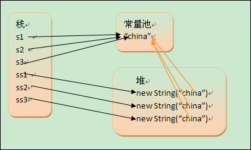
[原文链接](https://blog.csdn.net/weixin_27038245/article/details/114092016)


```java
int i1 = 9;

int i2 = 9;

int i3 = 9;

public static final int INT1 = 9;

public static final int INT2 = 9;

public static final int INT3 = 9;

```
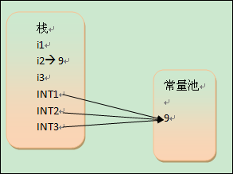
[原文链接：](https://blog.csdn.net/weixin_27038245/article/details/114092016)


### 方法重载

#### 特点

>-  同一个类，方法名一致
>- 参数个数/类型/顺序不一样
>- 与返回值、访问修饰符无关
>> ***注意:*** 顺序不同可以区分两个方法，但是不建议用，否则将增加代码维护难度

```java

public void info(){//方法一
}
public void info(int a, int b){//方法二
}
public int info(char a, int b){//方法三
}
private void info(int a, int b){//方法四
}
```

### 方法参数的设定

- **方法**


### 包的用法

#### 命名规则

- 只包含数字、字母、下划线、小圆点，不能以数字开头，不能是关键字和保留字 

#### 规范命名

- 一般是小写字母 + 小圆点

>com.公司名.项目名.业务模块名
com.edu.aust
com.sina.crm.user//用户模块
com.sina.order//订单模块
com.sina.utils//工具类


#### 使用规则

```java
// 引用包
import com.xiaoxie.Dog;//导入包中Dog类
import com.xiaoxie.*;//导入包中全部类
//不推荐使用导入全部类
```

如果再使用另一个包中的同名类，则在使用时要加上包名

```java
//例如一个文件中import xiaoxie.Dog
//在本文件下再新建另一个包中同为Dog的类，按照以下写法
xiaoxiaoxie.Dog dog = new xiaoxiaoxie.Dog();
```

### 访问修饰符

- **Java**提供四种访问控制修饰符, 用于控制方法和属性(成员变量)的访问权限(范围):

#### 注意事项

> 只有**默认**和**public**才能修饰类，并且遵循上述访问权限特点

1. **public** : 对外公开。

2. **protected** : 对子类和同一个包中的类公开。

3. **默认级别** : 向同一个包的类公开。

4. **private** : 只有类的本身可以访问，不对外公开。

> 同类, 同包,子类,不同包。

```java
class Dog{
    // 同包可以访问 n1,n2,n3,不能访问n4
    public int n1;
    protected int n2;
    int n3;
    private n4;
}
```
### 面对对象编程

* 特征：封装、继承、多态

#### 封装

- **概念:** 把抽象的数据（属性）和对数据的操作方法封装一起，保护在类的内部，在外部只能通过一些可用的方法才能对内部数据进行操作。

- **好处:** 不需要关心数据是如何被处理，方法是如何被实现的。

#### 继承(extends)

- **概念：** 用来解决代码复用。

- **好处：** 代码拓展性和维护性得到提高。

> 1. 父类：又叫超类或者基类
> 2. 子类：又叫派生类（可能拥有特有的属性和方法）
> 3. **特殊:** Object是所有类的父类

- **方法：** **extends**来声明继承父类

```java
//继承的基本语法
class son_Name extents father_Name{
}
//子类会自动继承父类定义的属性和方法
```

##### 细节
1. 子类无法**直接访问**父类的**私有属性和方法**，要通过**公共的方法**去访问
```java
class father{
    public String name;//公共属性
    private int wage;//私有属性

    //设置公共方法来设置类中成员属性
    public void setWage(int wage){
        this.wage = wage;
    }
    //设置共有方法来获取类中成员属性
    public int getWage() {
        return this.wage;
    }

    private void fun(){//创建私有方法
        System.out.println("私有方法");
    }
    public void callfun(){//创建公共方法
        System.out.println("通过公共方法来访问私有方法");
        this.fun();
    }
}
class son extends father{//继承父类 father
    public son(){
        this.name = "jack";
        // this.wage = 123;//报错：无法直接访问继承来自父类中的私有属性
        this.setwage(123);//正确：可以通过父类的公共方法来给从父类中继承的私有属性赋值。
        System.out.println("name:" + this.name + "\nwage:" + this.getWage());
        //通过父类中公共的方法访问子类中name属性的值
        //通过父类中公共方法getWage()来访问子类中继承来自父类的私有wage属性
        //this.fun();//报错：无法直接访问私有方法
        this.callfun();//可以通过公共方法来访问私有方法
    }
}
```
2. 子类必须调用父类的构造器(构造方法)，完成父类的初始化

```java
public class test {
    public static void main(String[] args) {
        Son son = new Son();
    }
}
class   Father{
    public Father(){//父类无参构造方法
        System.out.println("父类构造方法被调用...");
    }
}
class Son extends father{//子类无参构造方法
    public Son(){
        System.out.println("子类构造方法被调用...");
    }
}
//--->输出结果：父类构造方法被调用...子类构造方法被调用...
```

3. 当创建子类对象时，不管使用子类的哪个构造方法，**默认情况下总会去调用父类的无参构造器，如果父类没有无参构造器，则必须在子类的构造器中用super去指定父类的哪个构造方法**完成对**父类的初始化工作，如果有无参构造方法则默认调用构造方法，如果还有其他的构造方法也可以指定其他的构造方法**否则编译不会通过。

> 换个说法：子类继承父类时必须要调用父类一个构造方法，无论通过子类的何种构造方法

```java
class   Father{
    public int age;
    public father(){//父类无参构造方法
        System.out.println("父类无参构造方法被调用...");
    }
    public father(int age){
        System.out.println("父类(int age)构造方法被调用...");
    }
}
class Son extends father{//子类无参构造方法
    public son(){
        super(10);//如果不写或写成super();则默认调用父类的无参构造方法
        System.out.println("子类构造方法被调用...");
    }
}
//运行结果：--->父类的有参构造方法被调用...子类构造方法被调用...
//(并且子类继承的父类属性age值为10)
```
> **Tips:**
> **super(参数列表)**
>1. **不同的参数列表**指定父类**不同的构造方法**，super();或不写则默认调用父类无参构造器。
> 2. super()只能在构造方法中使用。
> 3. super()只能放在构造方法的第一行。
> 4. 有super()就不能用this()。this() 和super() 都是只能放在第一行。
```java
public class a01 {
    public static void main(String[] args) {
        son son = new son();
        System.out.println(son.age);
    }
}
class father{
    public int age;
    public father(){
        System.out.println("父类无参构造方法被调用...");
    }
    public father(int age){
        this.age = age;
        System.out.println("父类的有参构造方法被调用...");
    }
}
class son extends father{
    public son(){
        this(1);
        System.out.println("子类构造方法被调用...");
    }
    public son(int age){
        System.out.println("子类的int参数构造方法...");
    }
}
/*代码运行结果：
--->父类无参构造方法被调用...
    子类的int参数构造方法...
    子类构造方法被调用...
    0
*/
```
> 建议：在定义类时就定义一个无参构造器。

##### super关键字

- 基本概念：super代表父类的引用，用于访问父类的属性、方法、构造方法

- 基本语法:
> 1. 访问父类属性，但不能访问私有属性(private修饰)。 例：super.属性名;
> 2. 访问父类的方法，但不能访问私有方法(同上)。 例：super.方法名(参数列表);
> 3. 访问父类的构造方法。例:super(参数列表); ***只能放在子类构造方法的第一句(和this一样)***

##### super和this的区别

> **1. 访问属性**：this访问本类中的属性，如果本类没有则从父类中继续查找。super从父类开始查找
> **2. 调用方法**：this访问奔雷中的方法，如果没有则从父类中查找。super直接访问父类
> **3. 调用构造方法**：this调用本类的构造方法，必须放在构造方法的首行。super调用父类的构造方法，必须放在子类的首行。
> **4. 特殊**：this：表示当前对象。super：子类中访问父类对象

##### 方法重写/覆盖 @override

- 概念：子类有一个方法，与父类（可向上溯源）的某个方法名称，返回类型，参数一样，那么就说子类的这个方法覆盖了父类那个方法

- 注意事项和使用细节
> - 需要满足以下条件
> 1. 子类的方法的，参数，方法名称，要和父类方法的参数，方法名称完全一致
> 2. 子类的返回类型和父类方法返回类型一样，或者是父类返回类型的子类，**比如**父类返回类型是**Object**，子类方法返回类型是**String**。也就是说子类方法必须在父类方法的范围内
> 3. 子类方法不能缩小父类方法的访问权限
```java
// 子类返回类型是父类返回类型的子类
public Object getInfo(){
}
public String getInfo(){
}
// 子类方法不能缩小父类方法的访问权限
void fun(){
}
public void fun(){//可以
}
private void fun(){//报错
}
```

##### 方法重写和重载的区别

> - **重载__or__重写**
>> 1. 发生范围：***本类***_____ ***父子类***
>> 2. 方法名：***必须一样***_____ ***必须一样***
>> 3. 形参列表：***类型，个数，顺序，至少有一个不同***_____***相同***
>> 4. 返回类型：***无需求***______ ***子类重写的方法，返回的类型一致，或者其子类***
>> 5. 修饰符：***无需求***______ ***子类不能缩小父类方法的范围***

#### 多态

- 概念：提高代码复用性。

- 基础：建立于封装和继承之上的。

- 前提：两个类存在继承关系

- 方法或对象具有多种形态

- 多态是向上转型 

> getClass()方法可以查看运行类型

> **体现多态的几种方法**
> 1. 通过方法重载传递不同的参数列表，会调用不同的方法。
> 2. 通过方法重写，在父子类中，不同的类实现同名方法但结果各异。
> 3. 对象的多态： 父类的引用指向子类的对象(编译类型是父类，运行类型是子类)
```java
Animal animal = new Dog();//编译类型是Animal，运行结果是Dog
animal = new Cat();//运行类型是Cat，编译类型是Animal
//在这种情况下 编译的对象是父类，运行的对象是子类。
//意思就是javac去编译父类中的成员变量和方法
//
```
- 多态的向下转型（让父类对象使用子类对象特有的成员变量或方法）
```java
//语法
String stting = new (String)object;
//只能强制转换父类的引用，不能强制转换父类的对象。
//要求父类的对象必须指向的是当前目标类型的对象。
//可以调用子类类型中的所有成员。
class A{}
class B{}
class C{}
//...
A a = new B();//可以
B b = (B)a;//可以
C c = (C)a;//报错
```

> 动态绑定机制、属性看编译，方法看运行！！！！
> 属性没有动态绑定机制 

#### Object类方法

##### equals和 == 的对比

> - == 是一个比较运算符
> 1. ==：既可以判断基本类型，又可以判断引用类型
> 2. ==：如果判断基本类型，判断的是值是否相等。如：int i = 10； double d = 10.
> 3. ==：如果判断引用类型，判断的是地址是否相等，即判断是不是同一个对象

> - equals方法
> 1. 是Object类中的方法，只能判断引用类型
> 2. 默认判断的是地址是否相等，子类中往往重写该方法。用于判断内容是否相等

##### hashCode方法

1. 提高具有哈希结构的容器的效率
2. 两个引用如果指向同一个对象则哈希值一定一样
3. 哈希值是根据地址号来的，但不能将哈希值等价于地址
4. Object.hashcode
5. 后面在集合中的hashCode如果需要的话也要重写

***

##### finalize方法

1. 当对象被回收时，系统自动调用该i对象的finalize方法。子类可以重写该方法，做一些释放资源的操作
2. 什么时候被回收：当某个对象没有任何引用时，jvm就会认为这个对象是一个垃圾对象，就会使用垃圾回收机制来销毁该对象，在销毁该对象前，会先调用finalize方法。
3. 垃圾回收机制的调用，是由系统来决定的，也可以通过System.gc()主动出发垃圾回收机制
> 不会运用这个方法，这个方法在新版本已经被弃用

***

##### 断点调制

此处省略很多字

***

### 高级特性

#### 类变量、类方法

- 类变量也叫静态变量/静态属性，是该类的所有对象共有的变量，任何对象访问它时都是一样的，同样任何一个类去修改它，修改的也是同一个量。

- static 修饰的成员变量只会在第一次加载类时执行，之后再加载相同类时不会加载


```java
//定义方法
//访问修饰符static 数据类型 变量名; 推荐这种
//static 访问修饰符 数据类型 变量名;
//静态变量的访问修饰符范围和权限和普通属性一致。
```

```java
///访问方法
//类名.类变量名 推荐这种
//对象名.类变量名
```

>  生命周期：随类加载开始，随类销亡而销亡。

- 类方法也叫静态方法 

```java
//形式如下：
// 访问修饰符 static 数据返回类型 方法名(){} 推荐这种
// static 访问修饰符 数据返回类型 方法名(){}
```

```java
//类方法的调用：
// 类名.类方法名 或者 对象名.类方法名 (前提是 满足访问修饰符的访问权限和范围)
```

- 静态方法可以直接通过类名访问静态属性，不需要实例化对象

> 1. 类方法中无this和super
> 2. 静态方法不能访问普通方法和变量
> 3. 普通方法可以访问静态方法和静态变量
> 4. 类方法和类加载相关
> 5. 先加载类，再运行类的对象；
> 6. 静态方法不可以被重写：其实重写是为了运行时多态，而静态方法初始化时就和类做了绑定，哪来的什么多态特征，所以静态方法不能被重写，也没必要重写。
> 7. **static不能修饰构造方法**

***

#### 代码块

- 又叫初始化块，属于类中的成员[类的一部分]， 类似于方法，将逻辑语句封装在方法体中，通过{}包围起来。

- 和方法不同， 没有方法名， 没有返回值， 没有参数， 只有方法体， 而且不用通过对象或类的显式调用，而是加载类时，或创建对象时隐式调用。

```java
/* [修饰符]{
       代码
    }
*/
```
> 注意：
> 1. 修饰符可选，要写的话只能写static
> 2. 代码块分两类, 静态代码块，普通代码块
> 3. 逻辑语句可以为任何逻辑语句(输入，输出， 方法调用，循环，判断等)
> 4. ;号可以写上，也可以省略。 

- 代码块的好处；
1. 另一种构造器, 可以做初始化的操作
2. 如果多个构造器中都有重复语句， 可以抽取到初始化块中吗，提高代码的重用性
3. 代码块的调用优先于构造器（静态代码块 > 普通代码块 > 构造器）

- 使用细节

> 1. static（静态代码块）作用就是对类进行初始化，而且它随着类的加载而执行，并且只会执行一次。如果时普通代码块，每创建一个对象就执行一次
> 2. 类在什么时候加载？：（1）创建对象时 （new）。（2）建子类对象实例，父类也会被加载。（3） 使用类的静态成员时(静态方法，静态属性)。 
> 3. 普通代码块，在创建对象实例时， 会被隐式调用(只有在创建对象时才会被调用，如果只是使用类的静态方法或变量时，则不会调用)。被创建一次就会调用一次， 如果只是使用类的静态成员时， 普通代码块并不会执行。

- 创建对象时，类中各部分的调用顺序 ***（重点，重点，重点）***

1. 调用**静态代码块和静态属性初始化**（注意：静态代码块和静态属性初始化调用的优先级一样，如果有多个静态代码块和多个静态变量初始化，则按他们定义的顺序调用)
2. 调用**普通代码块和普通属性的初始化**（注意：普通代码块和普通初始化调用的优先级一样，如果有多个普通代码块和多个普通属性初始化，则按照定义顺序调用）
3. 调用**构造方法**
> 在构造方法中隐藏一个super() 和一个调用本类的普通代码块；

- 创建子类对象（继承关系）静态代码块，静态属性初始化， 普通代码块，普通属性初始化顺序如下：
1. 父类静态代码块和静态属性
2. 子类静态代码块和静态属性
3. 父类普通代码块和普通属性
4. 父类构造方法
5. 子类普通代码块和普通属性
6. 子类构造方法
7. 静态代码块只可以调用静态成员

> 静态方法和属性的经典使用：[设计模式](#1.1)：单例模式 <div id = "1.2"><div>
>
>
>
***
#### final 关键字

- final 可以修饰**类** / **属性** / **方法**

>使用场景
> 1. 不希望类被继承时可以使用final修饰
> 2. 当不希望父类的某个方法被子类覆盖/重写时，可以使用final关键字修饰
> 3. 当不希望类的某个属性值被修改，可以使用final修饰
> 4. 当不希望某个局部变量被修改，可以使用final修改
>

##### 注意事项：
1. final修饰的普通属性必须要赋值，可在1. 定义时 2. 普通代码块中 3. 在构造器中
2. final修饰的属性又叫常量 一般用XX_XX_XX来命名
3. 如果final 修饰的属性时静态的，则初始化的位置只能是1. 定义是 2. 在静态代码块中 不能在构造器中赋值
4. final类不可以被继承。但是可以实例化对象 
5. 如果类不是final类，但是含有fianl方法，则该方法虽然不能被重写，但是可以被继承
6. 如果该类已经时final类，则该类的方法就没必要用final来修饰
7. **final不能修饰构造方法**
8. final和static搭配使用，效率更高，不会导致类加载。底层编译器做了优化处理
9. 包装类（Integer, Double Float, Boolean都是final），String也是final类

***

#### 抽象类

- 抽象方法就是没有实现的方法体，只有方法的声明。
> 注意事项：
> 1. 当一个类存在抽象方法时，需要将该类**声明为abstract类**。 
> 2. 抽象类**会被继承**，其子类来实现抽象方法。
> 3. 抽象类**不能被实例化**
> 4. 抽象类**不一定**含有abstract方法
> 5. 一旦含有abstract方法，则这个类**必须声明为abstract**
> 6. abstract只能修饰类和方法，不能修饰属性和其他。
> 7. abstact **不能修饰构造方法**
> 8. 如果一个类继承了抽象类，则它必须实现抽象类的所有抽象方法，除非自己也声明为abstract类。
> 9. static 和 abstract 不能同时使用、final 和 abstract 也不能同时使用

***

- 抽象类最佳实践——[模板设计模式](#1.1)<div id = "1.3"><div>

***

#### 接口

- 只有方法名，没有方法体，在子类使用时，**要重写**

> 注意事项
> 1. 在接口中，抽象方法可以省略abstract关键字
> 2. 在JDK8以后，可以有默认实现方法，需要使用default关键字修饰。可以有静态方法，
可以实现
> 3. **不能被实例化**
> 4. 使用接口，就要实现接口的所有抽象方法。（idea中alt + enter快速重写）
> 5. 接口中所有方法都是public，不能用其他修饰符修饰
> 6. 一个类可以同时使用多个接口，但不能继承其他类
> 7. 接口中的属性只能final。而且是public static final（必须初始化）
> 8. 接口中属性的访问：接口名.属性名
> 9. 接口的修饰符只能是public


> **为什么要出现默认方法：**
>当一个接口添加新方法时，需要所有的实现类都重写新方法，影响到了已有的实现类，可能导致应用崩溃；因此为了避免这种问题的出现我们可以使用默认方法来解决。
>
> **默认方法的特点：**
> 1. 默认方法可以被实现类继承；
> 2. 默认方法可以被子类重写，也可以不重写；
>3. 子接口中如有同名默认方法，父接口中的默认方法会被覆盖
>
>**如何使用默认方法（default）**
1.当一个实现类实现了多个接口，多个接口里都有相同的默认方法时，实现类必须重写该默认方法，否则编译错误；
2.调用形式：对象名.默认方法名()
>**静态方法特点：(专指接口的)**
1.接口中的静态方法不能被子接口继承
2.静态方法不能被实现该接口的实现类继承—无论是创建接口类型的对象还是直接 创建实现类的对象都不能通过 对象.静态方法名来调用;
3.调用形式 只能通过： 接口名.静态方法名()。
**如何使用静态方法**
由于静态方法不能被实现类所继承，因此使用时必须要通过 接口名称.静态方法名


```java
interface IC_2{//定义一个接口IC_2
    default void a(){// IC_接口的默认a()方法
        System.out.println("IC_接口中的默认a()方法被实现...");
    }
    static void b(){//IC_接口中的静态b()方法，不可以被继承
        System.out.println("IC_接口中的静态b()方法");
    }
    void c();//IC_2接口同名抽象方法

}

interface IC_1 {//定义一个接口IC_1
    void c();//IC_1接口同名抽象方法

    default void a() {//Ic_接口中的默认方法，可以被重写
        System.out.println("Ic_接口中的a()默认方法被实现...");
    }
    static void b() {//Ic_接口中的静态方法，不可以被继承
        System.out.println("静态方法被实现...");
    }
    default void d() {//Ic_接口中的默认方法，可以被重写
        System.out.println("Ic_接口中的d()默认方法被实现...");
    }
}

//实现类，继承IC_1,IC_2 接口
class MyIC implements IC_1, IC_2{
    @Override
    //实现类重写IC_1，IC_2接口中同名抽象方法；
    public void c() {
        System.out.println("该类重写接口中普通抽象方法....");
    }
    @Override
    //实现类继承多个接口中含有同名默认方法，则实现类必须重写该默认方法
    public void a() {
        System.out.println("实现类继承多个接口中含有同名默认方法，则实现类必须重写该默认方法......");
    }

    public static void main(String[] args) {
        MyIC myIC = new MyIC();
        myIC.a();//实现接口中默认a()方法
        myIC.c();//实现多个接口中同名c()抽象方法
        IC_1.b();//实现IC_1接口中静态方法

    }
}
/*
*运行结果：
*实现类继承多个接口中含有同名默认方法，则实现类必须重写该默认方法......
*该类重写接口中普通抽象方法....
*静态方法被实现...
*/
```

参考来源[java中接口的使用(默认方法和静态方法)](https://blog.csdn.net/liyue_199609130/article/details/107544760)

##### 使用场景：

- 定义一个接口，被多个类使用，那么这多个类就有一个共同的接口父类，就可以用这个接口父类向下转型，达到统一管理的目的


##### 接口和继承的比较

- 解决问题不同

> 继承的价值在于：解决代码复用性和可维护性
> 接口的价值在于：设计，设计好各种规范方法，让其他类去实现这些方法

> 接口比继承更加灵活
> 接口比继承更加灵活，继承是满足**是什么**的关系，而接口只需满足**像什么**的关系

> 接口在一定程度上实现代码的解耦[即：接口规范性 + 动态绑定机制]

> 接口编程 + 动态绑定 + 匿名内部类 的综合使用

- 接口的多态属性

1. 多态参数 向下转型

2. 多态数组 向下转型

3. 接口存在**多态传递**显现


```java
interface c{
    int x = 1;
}
clas a{
    int x = 10;
}
class b extends a implements c{
    public void px(){
        //System.out.println(x);//Error x存在于父类a中也存在于接口c中，应该按照下列方式修改
        System.out.println("接口中的x" + c.x + "父类中的x" + super.x);
    }
}
class test{
    public static void main(){
        new b().px();
        
    }
}
```

***

#### 类的五大成员

- 属性，方法，构造方法，代码块，内部类

***

##### 内部类（4种）

- 特点：内部类的最大特点就是可以直接访问私有属性，并且可以体现类于类之间的包含关系

> ***分类：***
> 定义在外部类局部位置上(比如方法内)：**1>局部内部类(有类名)  2> 匿名内部类(没有类名，重点！！！！)**
> 定义在外部类的成员位置上:**3> 成员内部类(没有static修饰) 4> 静态内部类(使用static修饰)**

###### 局部内部类

- 是定义在外部类的局部位置，比如方法中(通常在方法中)，并且有类名。
1. 可以直接访问外部类的所有成员，包括私有
2. 不能添加访问修饰符，因为它的地位就是一个局部变量。局部变量不能使用修饰符。但是可以使用final修饰，因为局部变量可以使用final修饰
3. 作用域：仅仅在定义它的方法或代码块中
4. 局部内部类 ----> 访问 ----> 外部成员 **[访问方式： 直接访问]**
5. 外部类 ----> 访问 ----> 局部内部类的成员 **[访问方式： 创建对象，再访问(注意：必须在作用域内)]**
6. 外部其他类 -----> 不能访问 -----> 局部内部类(因为局部内部类是一个局部变量)
7. 如果外部类和局部内部类的成员重名时，就近原则，如果想要访问外部类的成员，可以用外部类.this.成员
***

###### 匿名内部类

- 定义在外部类的局部位置，比如方法中， 并且没有类名 
- 本质是类， 内部类，没有名字，是个对象
> 说明： 匿名内部类是定义在外部类的局部位置，比如方法中，并且没有类名


```java
//基本语法
// new 类或接口(参数列表){
//    类体
//}
```

> 注意事项
> 1. 使用一次就不能再使用
> 2. 抽象类的方法体内要实现方法
> 3. 不能添加访问修饰符
> 4. 作用域仅在定义它的方法和代码块中使用
> 5. 如果外部类和匿名内部类的成员重名时，内部类访问的话，默认遵循就近原则，如果想要访问外部类成员，使用 **(外部类名.this.成员)** 


> 调用方法

```java
class Out{
    A a = new A(){
        @Override
        public void hi(){
            System.out.println("匿名内部类重写hi方法");
        }
    }
    public static void main{
        //第一种调用方式
        Out out = new Out();
        out.hi();//--->“匿名内部类重写hi方法” 动态绑定机制，运行类型Out$1
    }
    //第二种调用方法（匿名内部类本身也是对象，可以直接.方法名(参数列表)）
    new A(){
            @Override
        public void say(String S){
            System.out.println("匿名内部类重写say方法：S = " + s);
    }.say("hi");//--->运行结果："匿名内部类重写say方法：S = hi"
}

class A{
    public void hi(){
        System.out.println("父类hi方法");
    }
    public void say(String S){
        System.out.println(S);
    }
}
```

- 匿名内部类的最佳实践
>  当作实参直接传递，简洁高效

```java
public class test03 {
    public static void main(String[] args) {
        f(new Ic() {//在参数列表传递一个匿名内部类
            @Override
            public void show() {
                System.out.println("匿名内部类作为参数传递给方法");
            }
        });
        //传统方法
        f(new ICC());
    }
    public static void f(Ic ic){//定义一个静态方法，该方法的参数是一个接口类型
        ic.show();
    }
}

interface Ic{//定义的一个接口
    void show();
}

//类-> 实现IL => 编程领域(硬编码)
//传统方法
class ICC implements Ic{
    @Override
    public void show() {
        System.out.println("传统方法");
    }
}
```

***

###### 成员内部类

- 成员内部类是定义在外部类的成员位置，并且没有static修饰
1. 可以直接访问外部类的所有成员，包括私有
2. 可以添加任意修饰符public，protected，默认，private

- 外部类使用成员内部类的三种方法

1. 外部类.内部类 = 外部类.new.内部类(参数列表);
2. 在外部类中编写一个方法，返回成员内部类
3. new 外部类()new 内部类();

> 注意：如果外部类和内部类重名， 内部类访问的话，遵守就近原则，如果想要访问外部类成员，使用：**外部类名.this.成员** 去访问

###### 静态内部类

- 定义在外部类的成员位置，而且有static修饰

1. 可以直接访问外部类的所有静态成员，包括私有，但是不包括非静态成员
2. 可与添加任意修饰符
3. 作用域: 同其他成员一样， 为整个类体
4. 外部类访问静态内部类 访问方式：创建对象再访问
5. 外部其他类访问静态内部类
>> 方式1. 外部类.内部类 = new 外部类.内部类();（因为是静态类，可以通过类名直接访问） 
>> 方式2. 编写一个方法可以返回静态内部类的实例 
6. 如果外部类和静态内部类成员重名时，静态内部类访问时，默认遵循就近原则，如果想要访问外部类的成员，则可以用 **外部类.成员** 去访问

***

### 枚举和注解

#### 枚举

- 枚举是一组常量的集合 这里可以理解：枚举属于一种**特殊的类**，里面只包含一组有限的特定的对象。

> 步骤：
1. 将构造器私有化
2. 去掉set方法，防止属性被修改
3. 在该类内部，直接创建固定的对象

```java
//1. 自定义枚举类
class Season{
    private String name;
    private String desc;
    // 私有化构造器
    private Season(String name, String desc) {
        this.name = name;
        this.desc = desc;
    }
    //* 不提供set方法
    //* 可以提供get方法
    //* 对外暴露对象(通过public final static 修饰符)
    //* 枚举对象/属性通常使用 final static 共同修饰 实现底层优化
    //* 对象名通常大写，常量命名规范
    //* 枚举对象根据需求，也可以有多个属性
    public final static Season SPRING = new Season("春天", "温暖");
    public final static Season SUMMER = new Season("夏天", "炎热");
    public final static Season AUTUMN = new Season("秋天", "凉爽");
    public final static Season WINTER = new Season("冬天", "寒冷");

    @Override
    public String toString() {
        return "Season{" +
                "name='" + name + '\'' +
                ", desc='" + desc + '\'' +
                '}';
    }
}
```

```java
//2. enum关键字实现枚举
//* 使用enum代替class
//* public final static Season SPRING = new Season("春天", "温暖");简化成
//SPRING("春天", "温暖")
//* 如果使用无参构造器创建枚举对象，则实参列表和小括号都可以省略
//* 当有多个枚举对象时要使用,号间隔,最后有一个;
//* 枚举对象必须放在枚举类的首行
enum Season2{
    SPRING("春天", "温暖"), SUMMER("夏天", "炎热"),
    AUTUMN("秋天", "凉爽"),WINTER("冬天", "寒冷");
    private String name;
    private String desc;

    private Season2(String name, String desc) {
        this.name = name;
        this.desc = desc;
    }

    @Override
    public String toString() {
        return "Season2{" +
                "name='" + name + '\'' +
                ", desc='" + desc + '\'' +
                '}';
    }
}
```
> 当我们用enum关键字开发一个枚举类时，默认会继承一个Enum类，而且是一个final类

##### enum 常用方法应用实例

1. toString：
2. name:输出常量名
3. ordinal：输出枚举对象次序（下标数，从0开始）
4. values：返回枚举对象常量的数组,可以用枚举数组接受
5. valudeOf：将字符串转换成枚举对象，要求字符串必须是已有常量名，否则会报错 使用方法(枚举类 指针名 = 枚举类.valueOf("枚举常量") )
6. compareTo：比较枚举常量的下标数 使用方法(枚举类.枚举常量1.compareTo(枚举类.枚举常量2)) *其核心源码 return 枚举变量1.ordinal - 枚举变量2.ordinal

##### enum 实现接口问题

- enum 默认在底层继承了ENUM类，故不可以再继承别的类  
- 但是可以实现接口

***

#### 注解

1. 注解也被称为元数据，用于修饰包/类/方法/构造器/局部变量等数据
2. 和注释一样，注解不影响程序逻辑，但注解可以被编译或运行，相当于嵌入在代码中的补充信息。
3. 在javaSE中，注解使用目的比较简单，例如标记过时的功能，忽略警告等，在javaEE中注解占据了更重要的角色，例如用来配置程序的任何切面，代替javaEE旧版中所遗留的冗余代码和XML配置等

> 使用Annotation 时要在前面加 @ 符号，并把Annotation当成修饰符使用

- 三个基本注释

1. @Override : 重写父类方法
2. @Deprecated ： 用于表示某个个程序元素（类，方法等）已过时
3. @SuppressWarnings ： 抑制编译器警告 用法：@SuppressWarnings("all") ---> 抑制所有警告，放置位置：放在哪块的上面就抑制那块的警告

- 元注解(修饰注解的注解，被称为元注解)---> ***了解即可***
1. Retention: 指定注解的作用范围， 三种SOURCE, CLASS, RUNTIME， 只能修饰一个注解，指定该注解可以保留多长时间 @Retention包含一个RetentionPolicy类型的成员变量。使用这个元注解时必须为该value成员变量指定值 
> 1. SOURCE:编译器使用后直接丢弃这种策略的注释（最短）
> 2. CLASS: 编译器将把该注释记录在class文件中，当运行java程序时jvm不会保留注释。这是默认值（中等）
> 3. RUNTIME： 编译器将把注释记录在class文件中。当运行java程序时 JVM会保留注释，程序可以通过反射获取该注释（最长）  
2. @Target : 指定注解可以在那些地方使用，其中有个参数value，即指定使用的位置
3. Documented: 指定该注解是否会在javadoc体现
4. Inherited 子类会继承父类注解  

***

### 异常处理

- 异常：程序执行种发生的不正常情况（语法错误和逻辑错误不是异常）。
- 如果异常被捕获，则程序会继续执行。

1. 异常事件分为两类
    - Error（错误）：jvm无法解决的严重问题，比如jvm系统内部错误，资源耗尽等，Error是严重错误，会使程序崩溃。
    - Exception: 其他因变成错误或偶然的外在因素导致的一般性问题，可以使用针对性的代码进行处理。例如空指针访问，试图读取不存在的文件
      - Excption分为两类：**运行时异常/编译时异常** 

#### 异常类型图

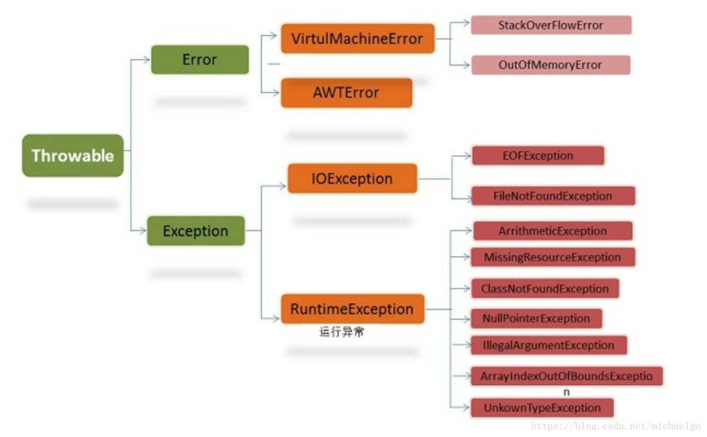


2. 运行时异常，编译器检查不出来，一般是编程时的逻辑错误，是程序员应该避免其出现的异常。

3. 对于运行时异常，因为这类异常很普遍，若全处理，可能对程序的可读性和运行效率产生影响。

4. 编译时异常，是编译器要求必须处理的异常。

```java
//五大运行时异常
//空指针异常
String name = null;
System.out.println(name.length());
//数学运算异常 ArithmeticException
System.out.println(10/0);
//数组越界下标异常
int[] arr = {1, 2};
System.out.println(arr[2]);
//类型转换异常
 class A{}
 class B extends A{}
 class C extends A{}
A b = new B();//可以
B b2 = (B)b;//可以
C c2 = (C)b;//抛出异常
//数字格式不正确异常
String name = "啦啦啦";
int num = Integer.parseInt(name);
System.out.println(num);//异常
```

```java
//编译异常
/*
FileNotFoundException:操作不存在文件时的异常
SQLException：操作数据库时发生的异常
IOException：操作文件时发生的异常
ClassNotFoundException：加载类，而类不存在时异常
EOFException：操作文件，到文件末尾发生异常
IllegalArguementException：参数异常
*/
```

#### 异常处理机制

```java
//try catch处理机制
try{
//可能存在问题的代码块
//如果出现异常则try块异常句后面的代码不会执行
}catch(NullPointerException e){
    //当异常发生时
    //系统将异常封装成Exception对象e，传递给catch
}catch(Exception e){
    //如果try中有多个异常则可以多个catch捕获
    //但是子类异常要写到父类异常前
}
finally{
    //不管try代码是否有异常发生，始终要执行finally
    //通常将释放资源的代码放到finally里
}
//----------------
//try-finally 配合使用
try{
    //代码
}finally{
    //强制执行
}
//这种写法没有捕获异常，如果产生异常则程序会直接崩掉
```

> 1. 如果没有出现异常，则执行try块中的语句，不执行catch块中语句。如果有finally，最后还需要执行finally里的语句
> 2. 如果出现异常，则try块中的异常发生后，try块剩下的语句 就不执行，将执行catch块中的语句，如果有finally，最后还需要执行完finally里面的语句。如果catch中有return语句 则return语句最后执行。


- throws处理机制：将异常抛出给调用的上一级，其中jvm处理机制：1.输出异常信息2. 终止程序

1. 如果一个方法中可能生产某种异常，但是并不确定如何处理这种异常，则此方法应显示地声明抛出异常，表面该方法将不对这些异常处理，而**由方法的调用者负责处理**
2. 在方法声明中用throws语句可以声明抛出异常的列表，throws后面的异常类型**可以是方法中产生的异常类型，也可以是它的父类**

#### throws异常处理的细节

1. 对于**编译异常**，程序中**必须处理**， 比如try-catch 或者throws
2. 对于**运行异常**，程序中如果没有处理，则默认为throws方法处理， **可以不处理有默认机制**
3. 子类重写父类的方法是，对抛出异常的规定：子类重写的方法，所抛出的异常类型要么和父类抛出的一致要么是父类抛出异常类型的子类
4. 在throws过程中，如果有try-catch方法，相当于异常处理，就可以不必throws 


#### 自定义异常

- 步骤

1. 自定义类：继承Exception或RuntimeException
2. 如果继承Exception，属于编译异常
3. 如果继承RuntimeException，属于运行异常（一般来说，继承RuntimeException）

```java
public class Exception_homework {
    public static void main(String[] args) {
        int age = 17;
        if (!(age >= 18 && age <= 120)) {
            throw new AgeException("请输入年龄在18-120之间");
        }
        System.out.println("年龄正确");
    }
}

class AgeException extends RuntimeException {
    public AgeException(String massage) {
        super(massage);
    }
}

```

#### throw 和 throws 的区别

|       |意义   |位置       |      后面跟的东西|
|:-:             |:-:         |:-:      |:-:    |
|throws|异常处理的一种或方式|方法声明处|异常类型|
|throw|手动生成异常对象的关键字|方法体中|异常对象|

***

### 常用类

#### 1. 包装类 Wrapper
 - 1. 针对八种基本数据类型相应的引用类型——包装类
 - 2. 有了类的特点就可以调用类的方法

|基本数据类型|包装类|
|:- |:- |
|boolen|Boolean|
|char|Character |
|byte|Byte|
|short|Short|
|int|Integer|
|long|Long|
|float|Float|
|double|Double|

> Character、Boolean 直接继承Object
> Integer、Byte、Short、Long、Floa、tDouble继承Number，Number继承Object

##### 包装类和基本数据类型之间的转换

1. jdk5前手动装箱和拆箱方式，装箱：基本类型->包装类型，反之，拆箱
2. jdk5后含jdk5的自动装箱和拆箱方式
3. 自动装箱底层调用的是valueOf方法，比如Integer.valueOf()

```java
//手动装箱
        int n1 = 100;
        Integer integer = new Integer(n1);
        Integer integer1 = Integer.valueOf(n1);
        //手动拆箱
        int i = integer.intValue();

        //自动装箱
        int n2 = 200;
        Integer integer2 = n2;
        //自动拆箱
        int n3 = integer2;
```
> 其他类型一样

```java
//三元运算符为一个整体，整体取最大的精度
Object obj1 = true? new Integer(1) : new Double(2.0);
System.out.println(obj1); ---> 1.0
```

##### 包装类和String类型之间的转换

```java
//        Integer -> String
        Integer i = 100;
        //方式一
        String str1 = i + "";
        //方式二
        String str2 = i.toString();
        String str3 = String.valueOf(i);
//        String -> Integer
        String str4 = "1234";
        Integer i2 = Integer.parseInt(str4);//使用自动装箱
        Integer integer = new Integer(str4);//构造器
```

##### 包装类的常用方法


> 用到什么查什么！！ 太多了！记不过来！

> 只有有基本数据类型， == 判断的就是值是否相等
```java
int n1 = 127;
Integer n2 = 127;
//n1 == n2 ----> true 
```


#### 2. String 类


- 继承Serializable接口 说明String对象可以串行化（对象可以在网络传输）

- 继承 Comparable接口，说明String对象可以进行比较

- 字符串字符使用Unicode字符编码，一个字符(不区分字母还是汉字)占两个字节

- 常用
  - String()
  - String(String) 
  - String(char[]) 
  - String(byte[], int, int) 
  - String(byte[])


- String类**不能被继承**
- String数据底层被存放在**char[]数组中**
- String 类是final类,不可被修改，但是不是指值不可修改，而是指地址不可修改。

> String的intern方法，该方法最终返回的是常量池的地址（对象）

***

##### String类的常用方法:


```java
String str = "hello";
//charAt:获取某索引处的字符
// str.charAt(1)-->'e'
str.substring(0, 4)
//--> "hell" 截取的范围是前闭后开
```


#### StringBuffer 类

- 其直接父类是AbstractStringBuilder, 在父类中有属性char[] value， 不是final，故该数据存放在堆中

- StringBuffer是一个final类，不能被继承

##### String和StringBuffer的区别

1. String保存的是字符串常量，里面的值不能更改，每次String类的更新实际上就是更改地址，效率较低 // **private static final char[] value;** 
2. StringBuffer保存的是字符串变量，里面的值可以更改，每次StringBuffer的更新实际上可以更新内容，不用更新地址，效率较高

> char[] value; //存放在堆上
> 所有变化(增，删)不用每次都更换地址，（不用每次都创建新的对象），所以效率高于String

##### StringBuffer类方法


> str.insert(索引位置,字符串); --> 在索引位置插入字符串，原先位置内容后移

#### StringBuild类

- 一个可变字符序列。此类提供一个与StringBuffer兼容的API，但不保证同步(不是线程安全)，被设计出来用作简易替换StringBuffer，用在字符串缓冲区被单个线程使用的时候。如果可能，优先采用该类，因为大多数时候比StringBuffer块

- StringBuild主要操作的是append和insert方法，可能重载这些方法，以接受任意类型的数据

- 和使用StringBufer方法一样

- final类 不能被继承

#### String VS StingBuffer VS StringBuild

1. String：不可变字符序列，效率低，但是复用率高 
2. StringBuffer:可变字符序列，效率高，线程安全
3. StringBuild：可变字符序列，效率最高，线程不安全


##### 使用原则：

1. 字符串存在大量操作，一般使用StringBuffer或StringBuild
2. 字符串存在大量操作：并且在单线程下使用StringBuild
3. 字符串存在大量修改操作，并在多线程下，使用StringBuffer
4. 如果字符串存在很少的修改，被多个对象引用，使用String


#### Math类

- 静态方法，直接用

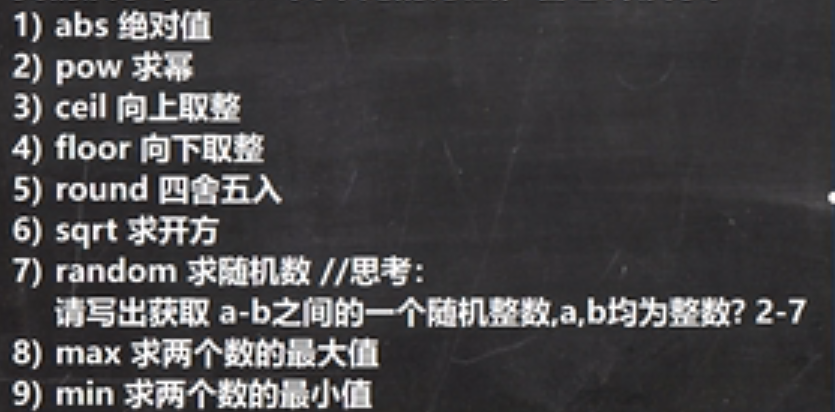


#### Arrays类

1. toString
2. sort
3. binarySearch :二分法查找，要求必须排好序
4. copyOf：第一个参数是原数组，第二个参数是原数组.长度，copy的是第二个参数长度的原数组，如果长度大于原数组，最后一个地方为null，如果长度<0，则报错
5. fill：数组元素的填充 ：替换原数组元素
6. equals：比较两数组元素是否一致，一样返回true不一样返回false
7. asList：将数组转换为list
```java
List aslist = Arrays.aslist(1,2,3,4);
//---> [1,2,3,4]
//asList的运行类型是Arrays$ArrayList
```

#### System类

- 常见方法


- System.Arrays.copy(src, srcPos, dest, destPos, length )的五个参数

|1|2|3|4|5|
|:-|:-|:-|:-|:-|
|src|srcPos|dest|destPos|length|
|源数组|从源数组哪个索引开始复制|目标数组|把源数组的数据拷贝到目标数组哪个位置|从源数组拷贝多少个数据|

> 如果拷贝个数大于源数组则会报错
> 一般这样写：(src, 0, dest, 0, src.length )

#### BigInteger 和 BigDecimal类

- BigInteger存放很大的Int型数 **new BigInteger("99999999999999999999");**
  - 存在对应的加减乘除方法
  - add、subtract、multipy、divide ( + - * /)
- BigDecimal存放很大的小数 **new BigDecimal("9.9999999999999999999");**
  - 也存在对应的加减乘除
  - add 、subtract、 multiply、 divide(可能抛出异常，需要在后面加ROUND_CEILING)

#### Date类


1. 第一代日期 Date
    - new Date()--->获取从1970年一月一日0：00到现在的时间
    - new Date(1111)----> 计算从1970年1月1日过了1111毫秒之后的时间
    - 可以把格式化字符串转为对于的Date .parse方法(会抛出异常 **throws:ParseException**)

    ```java
    Date date = new Date();
    SimpleDateFormat sdf = new SimpleDateFormat("yyyy-MM-dd HH:mm:ss E");
    System.out.println(sdf.format(date));
    ```

    - SimpleDateFormate(yyyy-MM-dd HH:mm:ss E); 
    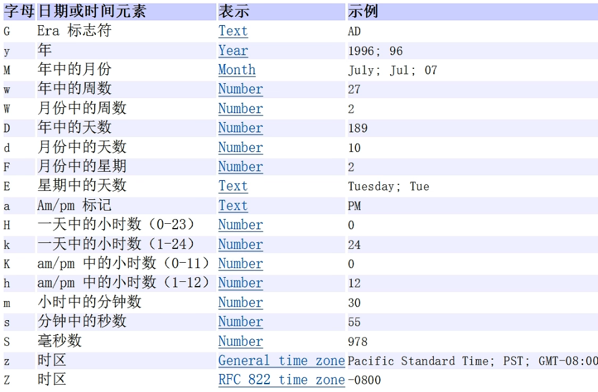

2. 第二代日期 Calender

    - 是一个抽象类， 而且构造器是私有的，可以通过getInstance来获取

    > 方法：
    >Canlender c =  Calender.getInstance();创建日历类对象，比较简单，获取的是所有日期信息的字段
    > 获取日历对象的某个日历字段
    ```java
    c.get(Calender.YEAR)//获取年
    c.get(Canlender.MONTH) + 1//获取月，需要+1，因为是从0开始的
    c.get(Canlender.DAY_OF_MONTH)//获取日
    c.get(Canlender.HOUR)//获取小时，如果需要获得24小时制的小时则是HOUR_OF_DAY
    c.get(Canlender.MINUTE)//获取分
    c.get(Canlender.SECOND)//获取秒
    //Calender没有专门的格式化方式，需要成需要自己组合
    ```

3. 第三代日期

- 为什么可以出现第三代 是因为前两代存在问题
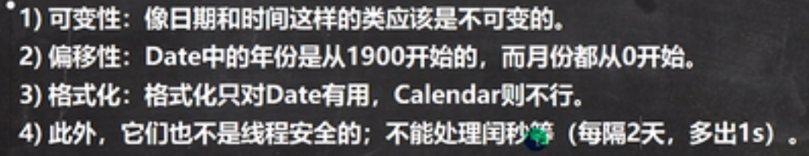

- 常用方法：**（JDK8加入的）**
    - 1. localDate(日期，年月日)
          只包含日期，可以获取日期字段
    - 2. localTime(时间，时分秒)
          只包含时间，可以获取时间字段
    - 3. localDateTime(日期时间，年月日时分秒)
          只包含日期+时间，可以获取日期和时间字段
    - 4. Instant 时间戳
          类似Date，提供了一系列Date类转换方法
          Instant---->Date
          Date date = Date.from(instant);
          Date ---> Instant
          Instant instant = date.toInstant();
        ```java
        Instant now = Instant.now();
        System.out.println(now);
        //将Instant对象转换为Date类
        Date date = Date.from(now);
        System.out.println(date);
        //将Date类转换为Instant
        Instant instant = date.toInstant();
        System.out.println(instant);
        ```

- 格式化第三代日期对象：
    - DateTimeFormat dtf = DateTimeFormatter.ofPattern(yyyy-MM-dd HH:mm:ss);
    ```java
    //获取第三代日期的字段表
    LocalDateTime ldt = LocalDateTime.now();
    System.out.println(ldt);
    //设置格式
    DateTimeFormatter dateTimeFormatter = DateTimeFormatter.ofPatter("yyyy-MM-dd HH:mm:ss");
    //将日期格式化并显示
    System.out.println(dateTimeFormatter.format(ldt));
    ```

***

### 集合

#### 引入集合：
 - 保存多个数据使用的时数组，那么数组有什么不足之处呢？
 - 1. 数组长度必须指定，一旦指定不能修改
 - 2. 保存的必须为同一类型元素
 - 3. 使用数组进行增加元素的代码比较麻烦 

#### 集合的好处：
 - 1. 可以动态保存任意多个对象，使用比较方便
 - 2. 提供一系列方便的操作对象的方法：add, remove, set, get
 - 3. 使用集合添加，删除新元素的代码比较简洁

#### 集合的两大类：

- 集合主要分两种：单列集合（存放单个对象），双列集合（键值对形式）
    - Collection有两个重要子接口：List, Set
    - Map接口实现子类是双列集合，存放K-V(键值对  )

##### 1. Collection: 单列集合


- Collection接口实现类的特点
    - 1. 存放多个元素，每个元素可以是Object
    - 2. 有些实现类，可以存放重复的元素
    - 3. 有些是有序的（List），有些是无序的（Set）
    - 4. Collection接口没有直接实现的子类（原因是接口不可以实例化），是通过它的子接口Set和List来实现的

- 常用方法
1. 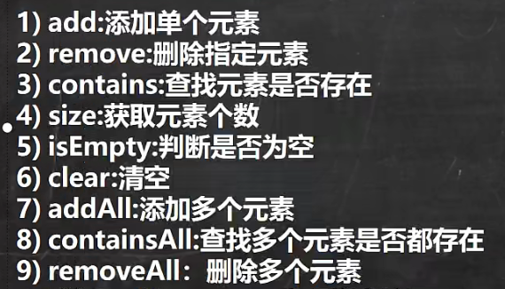

>适用于Collection下的所有实现类（Vector，ArrayList，LinkedList）

2. 遍历元素的方式
    - 使用Iterator(迭代器)（idea快捷键，itit）
        - 1. Iterator的对象称为迭代器，主要用于便利Collection集合中的元素
        - 2. 所有实现Collection接口的集合类都有一个iterator()方法，用来返回一个实   现了Iterator接口的对象，即可以返回一个迭代器
        - 3. Iterator结构
        - 4. Iterator仅用于遍历集合，Iterator本身并不存放对象
        - 5. 如果希望再次遍历，则需要对迭代器进行重置，将指针重置 
    - 使用foreach（快捷键，iter）
        - 特点：简化版的iterator，本质一样，只能遍历集合或数组
        - 注意：使用这种方法前一定要定义一个迭代器。
        ```java
        Iterator iterator = list.iterator();//定义一个迭代器
        ```

> 注意：
> 1. 集合无length()方法只有size()方法
> 2. ArrayList可以加入多个null
> 3. 是由数组来实现数据存储的
> 4. ArryList基本等同于Vector，除了ArrayList是线程不安全(执行效率高)，在多数情况下，不建议使用ArrayList

###### List 接口的基本介绍

1. list集合类中的元素有序（即添加顺序和去除顺序一致），且可重复。
2. List集合中的每个元素都有其对应的顺序索引，即支持索引。
3. List容器中的元素都对应一个整数型序号，记载其在容器中的位置，可以根据序号存取容器中的元素
4. Jdk API中List接口的实现类......

- 常用方法：
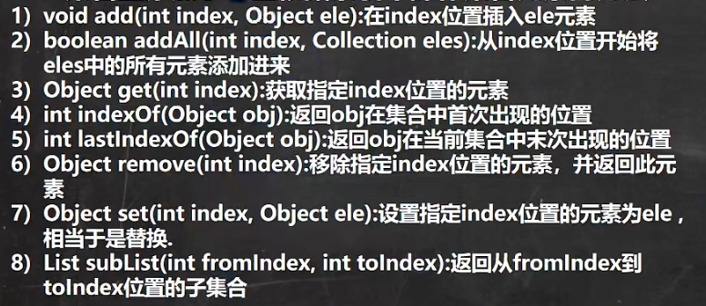


###### ArrayList底层源码和源码分析

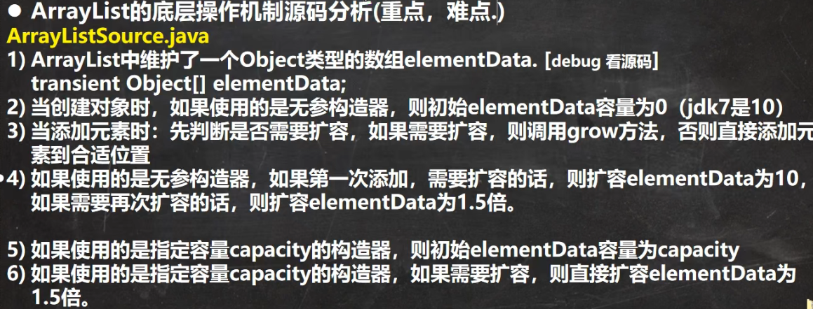

###### Vector底层源码和分析


###### ArrayList和Vector比较

||底层结构|版本|线程安全(同步)效率|扩容倍数|
|:-|:-|:-|:-|:-|
|ArrayList|可变数组|jdk1.2|不安全，效率高|如果有参，1.5倍；无参，第一次10，第二次1.5倍|
|Vector|可变数组 Object[]|jdk1.0|安全，效率不高|有参，每次2倍；无参，默认10，满后2倍|

###### LinkedList底层结构

###### 全面说明
1. 底层实现双向链表和双端队列的特点
2. 可以添加任意元素(元素可以重复)， 包括null
3. 线程不安全，没有实现同步

###### 底层操作机制

1. 底层维护的是双向链表
2. 两个属性，first，last分别指向首节点和尾节点
3. 每个节点(Node对象)，里面又维护了prev，next，item三个属性，其中通过prev指向前一个，next指向后一个，最终实现双向链表
4. 元素的增添不依靠数组完成，效率高
5. 模拟简单链表
```java
//模拟双向链表
 public static void main(String[] args) {
        Node node = new Node("1");
        Node node1 = new Node("2");
        Node node2 = new Node("3");
        node.next = node1;
        node1.pre = node;
        node1.next = node2;
        node2.pre = node1;

        Node first = node;
        Node last = node2;
        while (true){
            if(first == null){
                break;
            }
            System.out.println(first);
            first = first.next;
        }
    }
}
class Node{
    public Node pre;
    public Node next;
    private Object item;

    public Node(Object obj) {
        this.item = obj;
    }

    @Override
    public String toString() {
        return "Node{" +
                "obj=" + item +
                '}';
    }
}
```

###### ArrayList和LinkedList比较

||底层结构|增删效率|改查效率|
|:-|:-|:-|:-|
|ArrayList|可变数组|较低，数组扩容|较高|
|LinkedList|双向链表|较高，通过链表追加|较低|

- 如何选择ArrayList和LinkedList
1. 如果改查操作多，选ArrayList
2. 如果增删操作多，选LinkList
3. 一般来说，在程序中，多数是查询，所有大部分选择ArrayList
4. 在一个项目中，根据业务灵活选择，也可能这样，一个模块用ArrayList，另一个用LinkedList

###### Set接口和常用方法

- Set接口基本介绍：
1. 无序，没有索引
2. 不运行重复数据， 最多含一个null
3. Jdk API中Set接口实现类....

- 常用方法：
    - 和List接口一样，Set接口也是Collection子接口，因此，常用方法和Connection一样（遍历方式也一样，但不能使用索引）

###### HashSet

- 底层是HashMap

- 存储方式为 K - V

- 存储对象被封装为Node节点

- 存在红黑树树化机制(默认 table >= 64)

- 索引按照HashCode来计算，如果不同则按照不同的索引存储，如果相同则进行equals判断，如果还不太则按照链表存储

- 第一次添加，table扩容到16， 临界因子(0.75)，当table元素达到(16 * 0.75)12时，开始扩容，每次扩容增加2倍(第二次扩容为32)。

###### LinkedHashSet

- 底层维护(LinkedHashMap, HashMap子类)，底层结构数组 + 双向链表。  
- 有序

- 不允许重复元素

###### TreeSet

1. 本身提供一个无参构造器，使用这个构造器的TreeSet则无序
2. 可以传入一个比较器(传入一个匿名内部类)
3. 只能传入一组相同类型的数据
4. 不能传入相同元素
5. 底层就是TreeMap
6. 比较机制不是HashCode
7. 继承一个Comparable接口，自定义类需要重写compareTo才能往TreeSet里面加

##### 2. Map: 双列集合


- 特点：
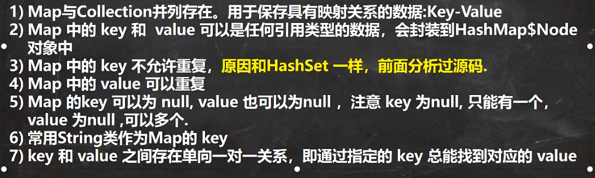

> 如果key重复则为替换

- Map接口常用方法

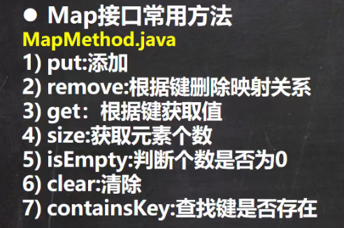

###### Map接口实现类 ↓


###### HashMap 小结

1. 常见接口实现类：HashMap，Hashtable 和 Properties。
2. HashMap 是 Map 接口使用频率最高的实现类。
3. HashMap 是以 key-Val对的方式来储存数据
4. key不能重复，但是值是可以重复，允许使用null键和null值
5. 如果添加相同的key，则会覆盖原来的key-val，等同于修改。(key不会替换，val会替换)
6. 与HashSet一样，不保证映射的顺序，因为底层是hash表的方式来存储的。（底层：数组+链表+红黑树）
7. HashMap没有实现同步，线程不安全。

###### Hashtable

1. 存放键值对

2. hashtable的键和值都不能为null

3. hashTable 使用方法基本和HashMap一样

4. HashTable是线程安全的，hashMap不是安全的

> 1. 初始化大小为11，临界因子0.75，当大小为8时(11 * 0.75)扩容，扩容为原先大小的2倍 + 1 (<< + 1,位运算左移 + 1)
>
>
>
>
>

###### Properties

1. 此类继承Hashtable类并且实现Map接口，也时使用一种键值对的形式来保存数据
2. 他的使用特点和Hashtable类似
3. 此类还可以用于从xxx.properties文件中，加载数据到Properties类对象，并inx读取和修改
4. 说明：工作后 xxx.properties 文件通常作为配置文件，这个知识点在IO流中距离

###### TreeMap

- 比较器中比较的是key而不是value

```java
TreeMap treeMap = new TreeMap(new Comparator() {
            @Override
            public int compare(Object o1, Object o2) {
                //通过这种方式比较的是字符串的不同
//                return ((String) o1).compareTo((String) o2);
                //通过这种方式只比较长度，如果长度相同的key则不会加入但是value会替换
                return ((String)o1).length() - ((String)o2).length();
            }
        });
        treeMap.put("lsp", "yzw");
        treeMap.put("dsb", "zjj");
        treeMap.put("yyds", "xx");
        System.out.println(treeMap);
```


###### 遍历方式

```java
//      迭代器遍历
        System.out.println("====迭代器====");
        Set keySet = map.keySet();
        Iterator iterator = keySet.iterator();
        while (iterator.hasNext()) {
            Object key = iterator.next();
            System.out.println(key + " " + map.get(key));
        }
//        foreach
        System.out.println("===foreach====");
        for (Object key : keySet) {
            System.out.println(key + " " + map.get(key));
        }
//      取出values
        Collection values = map.values();
//      foreach取values
        System.out.println("====foreach=====");
        for (Object value : values) {
            System.out.println(value);
        }
//      迭代器取values
        System.out.println("====迭代器====");
        Iterator iterator1 = values.iterator();
        while (iterator1.hasNext()) {
            Object value = iterator1.next();
            System.out.println(value);
        }
//      通过EntrySet方法
        System.out.println("====EntrySet方法====");
        System.out.println("====foreach====");
        Set entrySet = map.entrySet();
        for (Object enter : entrySet) {
//            将entry 转成Map.Entry
            Map.Entry m = (Map.Entry) enter;
            System.out.println(m.getKey() + " " + m.getValue());
        }
//        迭代器
        System.out.println("=====迭代器=====");
        Iterator iterator2 = entrySet.iterator();
        while (iterator2.hasNext()) {
            Object entry = iterator2.next();
//            向下转型为Map.Entry
            Map.Entry m = (Map.Entry) entry;
            System.out.println(m.getKey() + " " + m.getValue());
        }
```


##### 开发中如何选择集合实现类（重点重点重点）

- 取决于业务操作特点，然后根据集合实现类特点进行选择

1. 先判断存储的类型(一祖对象 [单列] 或一组键值对 [双列] )
2. 一组对象：Collection接口
    - 1. 不允许重复：List
        - 1. 增删多：LinkedList(底层维护一个双向链表)
        - 2. 改查多：ArrayList(底层维护Object类型的可变数组)
    - 2. 不允许重复：Set
        - 1. 无序: HashSet(底层时HashMap， 维护了一个哈希表，数组 + 链表 + 红黑树)(可以是一组不同类型数据)
        - 2. 排序：TreeSet(只能存放一组相同类型数据)
        - 3. 插入和取出顺序一致：LinkedHashSet(底层维护数组 + 双向链表)(可以存放不同类数据)
    - 3. 一组键值对：Map
            1. 键无序：HashMap(数组 + 链表 + 红黑树) 
            2. 键排序：TreeMap
            3. 键插入和取出顺序一致：LinkedHashMap
            4. 读取文件：Properties


#### Collections工具类

- 于Collection的区别
  - **Collection**是集合类的上级**接口**，继承与他有关的接口主要有List和Set
    **Collections**是针对集合类的一个**帮助类**，他提供一系列静态方法实现对各种集合的搜索、排序、线程安全等操作

- 工具类介绍

1. Collections是一个操作Set,List和Map等集合的工具类
2. Collections中提供了一系列静态的方法对集合元素进行排序，查询和修改等操作

- 排序操作(static方法)
  1. reverse(List)：反转List中元素的顺序
  2. shuffle(List)：对List集合元素进行随机排序
  3. sort(List)：根据元素的自然顺序(字母表顺序)对List集合元素按升序排序
  4. sort(List, Comparator)：根据指定的Comparator产生的顺序对List集合元素进行排序
  5. swap(List, int, int)：将指定list集合中的i出元素和j处元素进行交换
  
  - 查询/替换
  
  1. Object max(Collection): 根据元素的自然顺序，返回给定集合中的最大元素
  2. Object max(Collection, Comparator):根据Comparator指定顺序，返回给定集合中的最大元素
  3. min(Collection):
  4. min(Collection, Comparator):
  5. int frequency(Collection, Object):返回指定集合中指定元素出现的次数
  6. void copy(List dest, List src):将src中的内容复制到dest中
  7. boolean replaceAll(List list, Object aldVal, Object newVal):使用新值替换List对象的所有旧值


#### Comparable和Comparator接口的区别

- 两者的联系：
  
- Comparable相当于***“内部比较器”***，而Comparator相当于***“外部比较器”***。
  
- Comparable介绍

  - Comparable 是排序接口。
    若一个类实现了Comparable接口，就意味着“该类支持排序”。此外，“实现Comparable接口的类的对象”可以用作“有序映射(如TreeMap)”中的键或“有序集合(TreeSet)”中的元素，而不需要指定比较器。
    接口中通过x.compareTo(y)来比较x和y的大小。若返回负数，意味着x比y小；返回零，意味着x等于y；返回正数，意味着x大于y。

- Comparator介绍

  - ***Comparator 是比较器接口***。我们若需要控制某个类的次序，而该类本身不支持排序(即没有实现Comparable接口)；那么，我们可以建立一个“该类的比较器”来进行排序。这个“比较器”只需要实现Comparator接口即可。也就是说，我们可以通过“实现Comparator类来新建一个比较器”，然后通过该比较器对类进行排序。

    int compare(T o1, T o2)和上面的x.compareTo(y)类似，定义排序规则后返回正数，零和负数分别代表大于，等于和小于。
  
  [来源](https://blog.csdn.net/u010859650/article/details/85009595)

***

### 泛型

- 一种接受数据类型的类型 

- 为了解决不能对加入到集合中的数据进行约束(不安全)
- 为了解决遍历的时候，需要进行类型转换，如果集合中的数据较大，对效率有影响
- 好处：编译时检查添加元素的类型，提高了安全性，减少了类型转换的次数，提高效率


- 泛型声明
  
- 泛型可以定义在接口，类中
  
- 泛型实例化
  
- 要在类后面指定类型参数的值 
  
- 细节：
  - 在给泛型指定具体类型后，可以传入该类型或其子类型
  - 可以简写，右边的<>中的类型可以省略
  - 如果不写泛型，它默认的类型是Object
- 泛型不具备继承性
  
  - 
  
- 自定义泛型：

  - 1. 普通成员可以使用泛型(属性，方法)
    2. 使用泛型的数组不能初始化
    3. 静态方法中不能使用类的泛型(静态是和类相关的，在类加载时，对象还没有创建，所以不能用自定义泛型)
    4. 泛型类的类型，是在创建对象时确定的(因为创建对象时，需要指定确定类型)
    5. 如果在创建对象时，没有指定类型，默认为Object
    6. 泛型的标识符可以有多个，一般为单个的大写字母
    7. 接口中，静态成员不能使用泛型
    8. 泛型接口的类型，在继承接口或者实现接口时确定
    9. 接口没有指定类型默认Object

  > 我的理解：泛型就是一种未知的数据类型，可以是基本数据类型，也可以是自定义类型。
  >
  > 知识回顾：接口中的属性只能是public static final，且必须初始化。
  
  ```java
  //泛型方法：
  public <T, R> void fly(T t, R t){
      //泛型方法
      //泛型方法的参数类型更多变
  }
  //泛型类：
  class Fish<T, R>{
      //泛型类
      public void say(T t){
          //这不是泛型方法而是使用了泛型
      }
  }
  ```

*****

### JUnit工具类

- 一种测试工具

```java
@Test
```


### 进程，线程基础

- 程序：是为了特定任务，用某种语言编写的一组指令集合。

- 进程：1. 指运行中的程序，由操作系统分配内存空间。2. 进程是程序的一次执行过程，或是正在运行的一个程序，是动态过程：它有自身的产生，存在和消亡过程。

- 线程：1. 由进程创建，是进程的一个实体。2. 一个进程可以拥有多个线程
    - 单线程：同一时刻，只允许执行一个线程
    - 多线程：同一时刻，可以执行多个线程
    - 并发：同一时刻，多个任务交替执行，造成一种貌似同时的错觉，简单说，单核cpu实现的多任务就是并发
    - 并行：同一时刻，多个任务同时执行。多核cpu可以实现并行 (可能存在并发并行同时存在)

- 创建线程的两种方式
    1. 继承Thread类，重写run方法
    2. 实现Runnable接口，重写run方法
        - 当一个类已经继承一个类，则可以实现Runable接口实现线程
        - 这种方式不能直接调用start()方法
        - 创建Thread对象，实现start()方法
        - 这里底层使用了设计模式中的[代理模式](#1.4)  <div id = "1.5"><div>
    3. 当一个类继承Thread，该类变成一个线程 

- **注意**：主线程结束了，如果子线程还没结束，那应用程序也还没结束。

> start()方法调用start0()(本地方法，由JVM调用，底层是c++，c)方法后，该线程并不一定会立马执行，只是将线程变成可运行状态，具体什么时候执行，取决于cpu，由cpu统一调度。真正实现多线程的是start0()方法而不是run()

- 继承Thread 和 实现Runnable接口没有区别，底层都是使用start0()方法，并且实现Runable接口的方式更加适合多线程共享一个资源的情况，避免了单继承的限制。

- 线程终止：
    - 1. 当线程完成任务后，会自动退出
    - 2. 还可以通过使用变量来控制run方法停止线程，即通知方式 

- 常用方法：
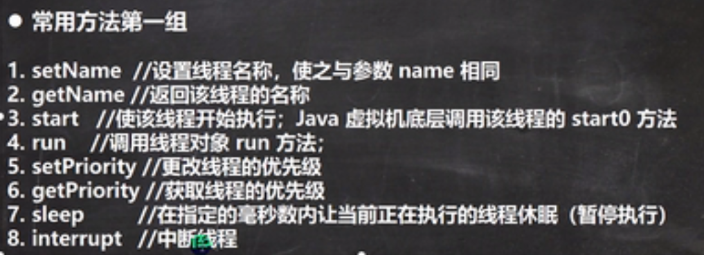
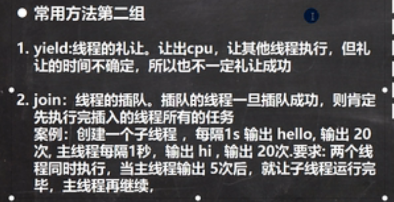

#### 用户线程，守护线程

1. 用户线程：也叫工作线程，当线程的任务执行完或通知方式结束

2. 守护线程：一般是为工作线程服务的，当所有用户线程结束，守护线程自动结束
    - 线程类.setDaemon(true)//设置为守护线程

3. 常见守护线程：垃圾回收机制

#### 线程的状态


#### 线程同步机制 

- 
    1. 在多线程编程中，一些敏感数据不允许被多个线程同时访问，此时就使用同步访问技术，保证数据在任何同一时刻，最多由一个线程访问，以保证数据的完整性。
    2. 这里可以理解：线程同步，即当有一个线程在对内存进行操作时，其他线程都不可以对这个内存地址进行操作，直到该线程完成操作，其他线程才能对该内存地址进行操作。

- 互斥锁
    - 1. Java里引用对象互斥锁的概念，来保证共享数据操作的完整性
    - 2. 每个对象都对应一个可称为互斥锁的标记，这个标记用来保证在任意时刻，只能有一个线程访问该对象。
    - 3. synchronized 关键字来与对象互斥锁联系，当某个对象用synchronized来修饰时，表明该对象在任意时刻只能由一个线程访问
        - 存在的问题：
            1. 如果 sleep()放在synchronized内，会导致别的线程无法获得这把锁
            2. 换句话说，拿到锁的线程睡着了，你无法(也有可能，当数据很大时)在它睡着的时候拿到它手里的锁
            3. 不能将锁(synchronized)放在循环外面，会导致一个线程疯狂拿锁 
            ```java
            //例子区别看
            //例1
            synchronized (this) {
                if (ticket <= 0) {
                    break;
                }
                try {
                    Thread.sleep(50);
                } catch (InterruptedException e) {
                    e.printStackTrace();
                }
                System.out.println("窗口" + Thread.currentThread().getName());
            }
            //例2 正常情况
            synchronized (this) {
                if (count <= 0) {
                    break;
                }
                System.out.println(Thread.currentThread().getName());
            }
                try {
                    Thread.sleep(10);
                } catch (InterruptedException e) {
                    e.printStackTrace();
                }
            ```
    - 4. 同步的局限性：导致程序的执行效率要降低
    - 5. 同步方法(非静态的)的锁可以是this，也可以是其他对象(要求是同一个对象)
    - 6. 同步方法(静态的)的锁为当前类本身
    - **细节：**
    - 1. 同步方法如果没有使用static修饰，默认锁对象为this
    - 2. 如果使用static修饰，默认锁对象为当前类.class
    - 3. 实现的落地步骤：
        - 1. 需要先分析上锁的代码。
        - 2. 选择同步代码块或同步方法。
        - 3. 要求多个线程的锁对象为同一个即可。

#### 线程的死锁

- 多个线程都占用对方的锁资源，但不肯相让，导致死锁，在编程时一定要避免死锁的发生
```java
public class DeadBlock {
    public static void main(String[] args) {
        T2 A = new T2(true);
        A.setName("A线程");
        T2 B = new T2(false);
        B.setName("B线程");
        A.start();
        B.start();
    }
}

class T2 extends Thread{
    private static Object object1 = new Object();
    private static Object object2 = new Object();
    boolean flag;

    public T2(boolean flag) {
        this.flag = flag;
    }

    @Override
    public void run() {
        if(flag){
            synchronized (object1){
                System.out.println(Thread.currentThread().getName() + "进入1");
                synchronized (object2){
                    System.out.println(Thread.currentThread().getName() + "进入2");
                }
            }
        }else{
            synchronized (object2){
                System.out.println(Thread.currentThread().getName() + "进入3");
                synchronized (object1){
                    System.out.println(Thread.currentThread().getName() + "进入4");
                }
            }
        }
    }
}
```
- 释放锁
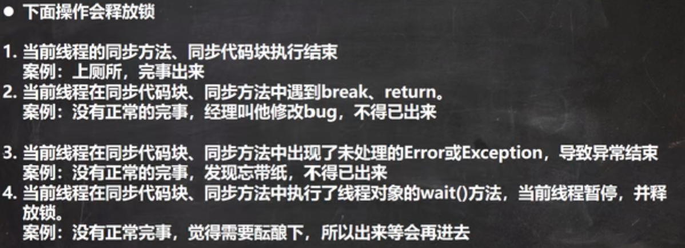
- 不会释放锁 
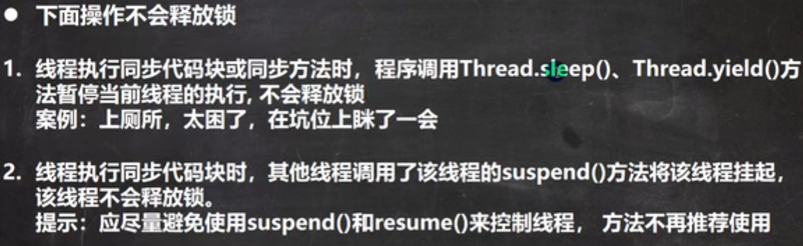


## 一些特殊的方法 

### Java中生成随机数的方法

- 1. (数据类型)(最小值+Math.random()*(最大值-最小值+1))  

```java
//随机生成从1-10的int型随机数
(int)(1+Math.random()*(10-1+1))
```

- 2. 通过java.util包中的Random类的nextInt方法来得到1-10的int随机数

```java
//随机产生1-10的整形随机数
Random ra = new Random();
ra.nextInt(10) + 1;
```

### 从键盘输入整数

```java
Scanner in = new Scanner(System.in);
int randnum = in.nextInt();
```

### 将字符串转为整数

```java
String str = "123";
int a = Integer.parseInt(str);//将字符串"123"转为整形123
```


## 正则表达式

```java
int numV = 0;
int numS = 0;
String regex = "[aAeEiIoOuU]";
for (int i = 0; i < s.length(); i++) {
	char ch = s.charAt(i);
	if(ch == ' '){
		numS++;
    }else if((String.valueOf(ch)).matches(regex)){
       //String.valueOf方法将字符变为字符串，然后使用String的matches方法 
		numV++;
	}
```


## 设计模式（23种）

<div id = "1.1">设计模式<div>

1. ***单例模式：***
（采取一定的方法保证载整个软件系统中，对某个类只能存在一个对象实例，
并且该类只提供一个取得其对象实例的方法。）
两种方式：1> 饿汉式 2> 懒汉式
```java
//步骤：1. 构造器私有化=》防止直接new 
//2. 类的内部创建对象 
//3. 向外暴露一个静态的公共方法 getInstance 
//4. 代码实现
//饿汉式:可能存在创建了对象但是没有使用造成内存浪费 
class SingleTon{
    //构造器私有化，防止直接new
    private SingleTon(){}
    //提供一个静态属性 SingleTon
    //先创建好这个SingleTon对象实例
    private static SingleTon instance = new instance();
    //提供一个公开的静态方法，返回instance
    public static SingleTon getInstance(){
        return instance;
    }
}
//懒汉式：只有当用户使用getInstance时才会创建一个对象
//并且下次调用时返回的还是原先的对象 
class SingleTom{
    //将构造器私有化防止直接new
    private SingleTom(){}
    //提供一个instance私有静态属性
    private static SingleTom instance;
    //提供一个公开的方法 可以返回instance
    public static SingleTom getInstance(){
        if(instance == null){
            instance = new SingleTom;
        }
        return instance;
    }
}
//区别：饿汉式不存在线程安全问题，懒汉式存在线程安全问题。饿汉式存在浪费资源的可能。
```
[返回静态属性的应用](#1.2)

***

2. 观察者模式
3. 工厂模式
4. 适配器模式
5. 代理模式
<div id = "1.4">代理模式<div>
```java
//代理模式实现java中Runable接口
class B implements Runnable{
    private Runnable target = null;
    @Override
    public void run() {
        if (target!=null){
            target.run();
        }
    }
    public B(Runnable target){
        this.target = target;
    }
    public void start(){
        start0();
    }
    public void start0(){
        run();
    }
}
```
[返回](#1.5)

6. 模板模式
> 抽象出一个父类，父类中拥有子类共有的方法和属性，也有同名的方法，但是内容不同，需要重写
[返回抽象类的应用](#1.3)
7. 职责链模式
8. 其他（组合模式，桥链模式，原型模式......）

****

## 事件监听

- Java事件处理时采取“委派事件模型”。当事件发生时，产生事件的对象，会把此“信息”传递给“事件的监听者”处理，这里所说的“信息”实际上就是java.awt.event事件类库里某个类所创建的对象，把它称为“事件的对象”。
- 包含概念：**事件源**，**事件**，**事件监听器**
  - 事件源：事件源是一个产生事件的对象，比如按钮，窗口等
  - 事件：事件就是承载事件源状态改变时的对象，比如当键盘事件，鼠标事件，窗口事件等等，会产生一个事件对象，该对象保存着当前事件很多信息，比如KeyEvent对象含有被按下键的Code值。java.awt.event包和javax.swing.event包中定义了各种事件类型。

- 常见事件类


## 奇怪的注释

```java
/**
 *                             _ooOoo_
 *                            o8888888o
 *                            88" . "88
 *                            (| -_- |)
 *                            O\  =  /O
 *                         ____/`---'\____
 *                       .'  \\|     |//  `.
 *                      /  \\|||  :  |||//  \
 *                     /  _||||| -:- |||||-  \
 *                     |   | \\\  -  /// |   |
 *                     | \_|  ''\---/''  |   |
 *                     \  .-\__  `-`  ___/-. /
 *                   ___`. .'  /--.--\  `. . __
 *                ."" '<  `.___\_<|>_/___.'  >'"".
 *               | | :  `- \`.;`\ _ /`;.`/ - ` : | |
 *               \  \ `-.   \_ __\ /__ _/   .-` /  /
 *          ======`-.____`-.___\_____/___.-`____.-'======
 *                             `=---='
 *          ^^^^^^^^^^^^^^^^^^^^^^^^^^^^^^^^^^^^^^^^^^^^^
 *                      佛祖保佑        永无BUG
*/
```

# JavaNote
